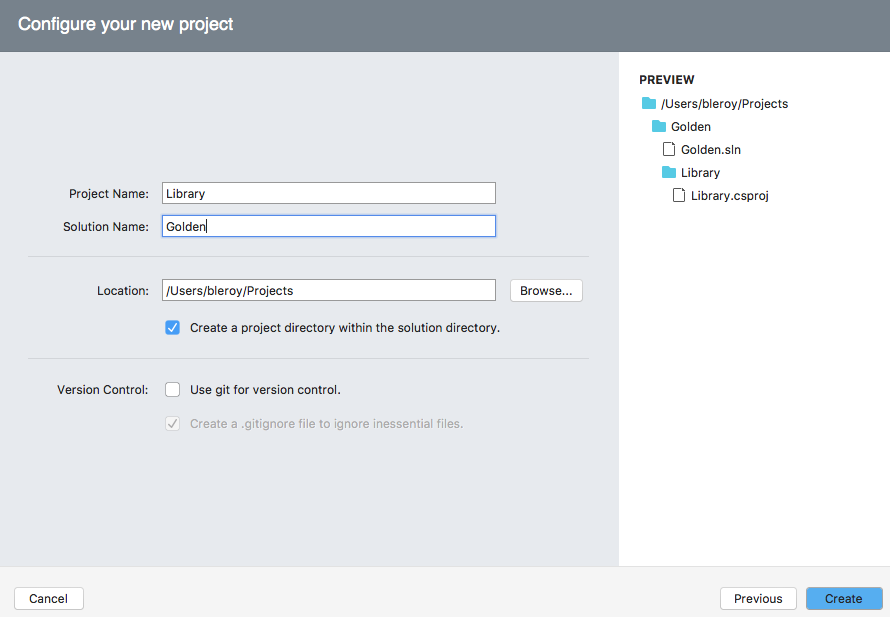
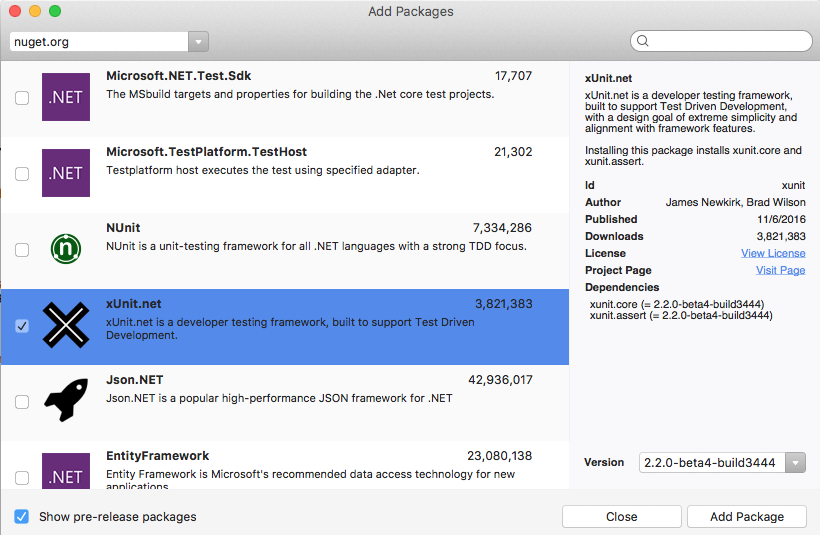

---
title: Building a complete .NET Core solution on macOS, using Visual Studio for Mac
description: Building a complete .NET Core solution on macOS, using Visual Studio for Mac
keywords: .NET, .NET Core, macOS, Mac
author: bleroy
manager: wpickett
ms.date: 11/16/2016
ms.topic: article
ms.prod: .net-core
ms.technology: .net-core-technologies
ms.devlang: dotnet
ms.assetid: d743134a-08a3-4ff6-aab7-49f71f0568c3
---

# Building a complete .NET Core solution on macOS, using Visual Studio for Mac

by [Bertrand Le Roy](https://github.com/bleroy) and [Phillip Carter](https://github.com/cartermp)

Visual Studio for Mac provides a full-featured development environment for developing .NET Core applications. The procedures in this document describe the steps necessary to build a typical .NET Core solution that includes reusable libraries, testing, and using third-party libraries. 

## Prerequisites

Follow the instructions on [our prerequisites page](../macos-prerequisites.md) to update your environment.

# A solution using only .NET Core projects

## Writing the library

1. In Visual Studio, choose **New Project**. In the new project dialog, choose **Library** under **.NET Core**, then select **Class Library (.NET Core)**. Click **Next**.

   

2. Name the project "Library" and the solution "Golden". Leave **Create a project directory within the solution directory** checked. Click **Create**.

   

3. In the solution explorer, open the context menu for the **Dependencies** node and choose **Add Packages...**.

4. Choose "nuget.org" as the Package source, and check **Json.NET**. Click **Add Package**. The package should now appear under **Dependencies/NuGet** and be automatically restored. [Json.NET](http://www.newtonsoft.com/json) is the recommended library and what our code will use to perform [JSON](http://www.json.org/) serialization and deserialization.

   

5. Rename the `MyClass.cs` file to `Thing.cs`. Also rename the class and constructor `Thing`. Add a method: `public int Get(int number) => Newtonsoft.Json.JsonConvert.DeserializeObject<int>($"{number}");`

7. On the **Build** menu, choose **Build All**.

   The solution should build without error.

### Writing the test project

1. In the solution explorer, open the context menu for the Golden solution node and choose **Add**, **Add New Project...**. In the new project dialog, choose **.NET Core / Library** and then **Class Library (.NET Core)**. Click **Next**. Name the new library "TestLibrary" and click **Create**. 

2. In the **TestLibrary** project, open the context menu for the **References** node and choose **Edit References...**. Check the Library project and click **OK**. This adds a reference to your library from the test project.

   

3. The test framework that we're going to use is [NUnit](https://www.nunit.org/). NUnit is still a [Portable Class Library](https://msdn.microsoft.com/en-us/library/gg597391(v=vs.110).aspx) as I'm writing this. It will eventually be a .NET Standard library, but in the meantime, we need to make a small modification to the project file before we can use NUnit. Right-click the **TestLibrary** project in the solution explorer and chose **Tools / Edit File**. Add the following tag under the first `PropertyGroup`: `<PackageTargetFallback>$(PackageTargetFallback);portable-net45+win8</PackageTargetFallback>`. This has the effect of relaxing the build system so that it pretends that it's a runtime that NUnit supports explicitly. Save and close the project file.

   

4. Right-click **Dependencies** under the solution explorer and choose **Add Packages...**. Search for nunit, check "NUnit" and click **Add Package** (the version you see may vary; the latest is usually the best choice).

   

5. Rename the `MyClass.cs` file to `LibraryTests.cs`, then open it and also rename the class and remove the constructor. Add `using Library;` and `using NUnit;` to the top of the file, and change the code for the class to:

    ```csharp
    [TestFixture]
    public class LibraryTests
        [TestCase(42)]
        [TestCase(0)]
        [TestCase(-1)]
        public void ThingGetsObjectValFromNumber(int number)
        {
            Assert.That(new Thing().Get(number), Is.Equal.To(number));
        }
    }
    ```

   You should now be able to build the solution.
   
> **Work in progress**
   
4. On the **Test** menu, choose **Windows**, **Test Explorer** in order to get the test explorer window into your workspace. After a few seconds, the `ThingGetsObjectValFromNumber` test should appear in the test explorer. Choose **Run All**.
   
   The test should pass.

### Writing the console app

1. In Solution Explorer, open the context menu for the solution, and add a new **Console App (.NET Core)** project. Name it "App", and set the location to `Golden\src`.

2. In the **App** project, open the context menu for the **Dependencies** node and choose **Add**,  **Reference**. 

3. In the **Reference Manager** dialog, check **Library** under the **Projects**, **Solution** node, and then click **OK**

6. Open the context menu for the **App** node and choose **Set as StartUp Project**. This ensures that hitting F5 or CTRL+F5 will start the console app.

7. Open the `Program.cs` file, add a `using Library;` directive to the top of the file, and then add `Console.WriteLine($"The answer is {new Thing().Get(42)}");` to the `Main` method.

8. Set a breakpoint after the line that you just added.

9. Press F5 to run the application..

   The application should build without error, and should hit the breakpoint. You should also be able to check that the application output "The answer is 42.".
